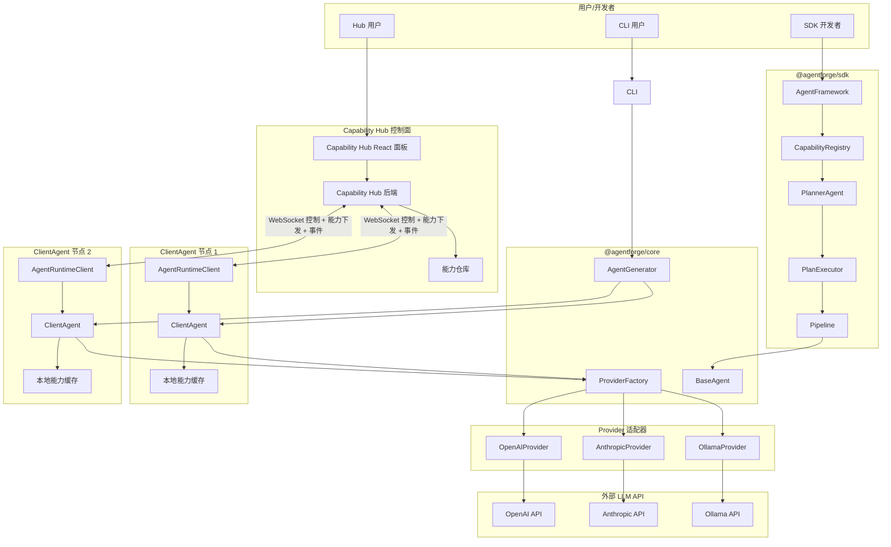

# AgentForge 技术设计文档

> **文档层级**: 第二层 · 设计规格
> **文档类型**: 设计规格
> **文档状态**: 已定稿
> **文档版本**: docs-v0.4
> **最后更新**: 2026-06-24
> **实现状态**: 未开始
> **配套文档**: [PRD.md](../product/PRD.md)（产品需求）、[01-核心设计.md](./01-核心设计.md)（接口定义）、[08-客户端Agent与无状态Agent.md](./08-客户端Agent与无状态Agent.md)（形态分野）、[09-能力市场与下发.md](./09-能力市场与下发.md)（能力模型）、[10-安全模型.md](./10-安全模型.md)（安全设计）

---

## 1. 技术概览

| 项 | 值 |
|---|---|
| 语言 | TypeScript 5.4+ |
| 运行时 | Node.js ≥ 18 |
| 包管理 | pnpm workspace（Monorepo） |
| 构建工具 | tsup（后端）、Vite（前端） |
| 测试框架 | Vitest |
| 代码规范 | ESLint 9 + Prettier 3 |
| 前端框架 | React 18 + TailwindCSS 4 |

---

## 2. 系统架构

### 2.1 分层架构

```
┌─────────────────────────────────────────────────────┐
│  用户交互层                                           │
│  CLI (commander)  │  Capability Hub (React)         │
├─────────────────────────────────────────────────────┤
│  平台层                                              │
│  @agentforge/cli  │  @agentforge/sdk  │  dashboard │
├─────────────────────────────────────────────────────┤
│  运行时层                                            │
│  @agentforge/core  │  @agentforge/runtime-client    │
├─────────────────────────────────────────────────────┤
│  基础层                                              │
│  @agentforge/types                                   │
├─────────────────────────────────────────────────────┤
│  外部 Provider                                       │
│  OpenAI  │  Anthropic  │  Ollama  │  Custom API     │
└─────────────────────────────────────────────────────┘
```

### 2.1.1 架构全景图（Mermaid）



### 2.2 Monorepo 目录结构

```
agentforge/
├── packages/
│   ├── core/                  # 核心运行时
│   │   └── src/
│   │       ├── agent/         # IAgent + BaseAgent + ClientAgent + StatelessAgent
│   │       ├── runtime/       # MiddlewareChain, PluginManager
│   │       ├── provider/      # IProvider + OpenAI/Anthropic/Ollama 实现
│   │       ├── plugin/        # IPlugin
│   │       └── generator/     # AgentGenerator + PromptBuilder + TemplateEngine
│   ├── types/                 # 纯类型定义（零运行时依赖）
│   ├── sdk/                   # 编排 SDK
│   │   └── src/
│   │       ├── AgentFramework.ts   # 框架主类
│   │       ├── CapabilityRegistry.ts
│   │       ├── ModelRegistry.ts    # 多端点模型解析（实现类）
│   │       ├── planner/            # PlannerAgent + PlanExecutor
│   │       ├── Pipeline.ts         # 流水线
│   │       ├── EventBus.ts
│   │       └── index.ts
│   ├── runtime-client/        # 客户端运行时（核心包）
│   │   └── src/
│   │       ├── AgentRuntimeClient.ts
│   │       ├── WebSocketTransport.ts
│   │       ├── HeartbeatManager.ts
│   │       ├── CapabilityCache.ts
│   │       └── index.ts
│   ├── cli/                   # CLI 工具
│   │   └── src/commands/      # create, batch, run, serve, dashboard, capability
│   ├── http-server/           # ClientAgent 本地调试 HTTP 服务（可选）
│   │   └── src/
│   │       ├── server.ts
│   │       ├── routes/agents.ts
│   │       └── routes/health.ts
│   └── dashboard/             # Capability Hub 面板 + 后端
│       ├── src/
│       │   ├── pages/         # Home, ClientAgentList, ClientAgentCreate, ClientAgentDetail, CapabilityList, CapabilityMarket, CapabilityDetail, CapabilityDistribute, NodeList, NodeDetail, NodeChat, Playground, Monitor
│       │   ├── components/
│       │   ├── api/
│       │   └── store/
│       ├── server/            # Capability Hub 后端
│       │   ├── index.ts
│       │   ├── routes/
│       │   └── websocket/
│       ├── index.html
│       ├── vite.config.ts
│       └── package.json
├── templates/                 # ClientAgent 代码模板
│   ├── base/                  # 通用模板（main.ts / agent.ts / prompts.ts / tools.ts / runtime.ts / security.json）
│   └── roles/                 # 岗位模板
├── examples/                  # 使用示例
├── package.json
├── pnpm-workspace.yaml
└── tsconfig.base.json
```

---

## 3. 核心模块设计

### 3.1 IAgent 接口

`IAgent` 是 AgentForge 的核心契约，所有 Agent 的统一接口。完整定义见 [01-核心设计.md §1.1](./01-核心设计.md#11-iagent-统一接口)。

AgentForge 中存在两种实现形态：

- **ClientAgent**：运行在用户机器上的客户端应用，有状态，可连接 Capability Hub。
- **StatelessAgent**：由 SDK 在进程内实例化的无状态 Agent，用于编排工作流。

**状态机：**
```
UNINITIALIZED → INITIALIZING → READY → DAEMON_RUNNING ⇄ RUNNING
                              ↓         ↓
                            ERROR ←────┘
                              ↓
                           DESTROYED（不可逆）
```

`daemon-running` 为 ClientAgent 守护进程状态：守护进程已启动，等待远程或本地任务。

### 3.2 AgentConfig（多 Provider 联合类型）

`AgentConfig` 与 `ModelConfig` 类型定义见 [01-核心设计.md §1.4](./01-核心设计.md#14-agentconfig-配置模型)。

### 3.3 Provider 适配器

`IProvider` 接口定义见 [01-核心设计.md §1.12](./01-核心设计.md#112-iprovider-接口与聊天类型)。

Provider 工厂根据 `config.model.provider` 自动选择对应实现：

```typescript
class ProviderFactory {
  private static registry = new Map<string, new (config: any) => IProvider>();

  static register(type: string, ctor: new (config: any) => IProvider): void;
  static create(modelConfig: ModelConfig): IProvider;
  // 内置注册 openai / anthropic / ollama
  // 用户可通过 plugin 注册 custom provider
}
```

### 3.4 BaseAgent 抽象类

生成 Agent 的基类，内置通用能力。完整接口定义见 [01-核心设计.md §1.2](./01-核心设计.md#12-clientagent-与-statelessagent-扩展接口)；本节仅说明实现细节，不重复声明类型。

`BaseAgent` 的 `init` 与 `execute` 负责状态迁移、中间件链、Provider 创建与事件发射，最后调用子类实现的 `doInit` / `doExecute` 钩子。关键执行流程如下：

```typescript
async init(config?: TConfig): Promise<void> {
  this._status = AgentStatus.INITIALIZING;
  // 1. 保存配置；若未传入则复用 constructor 中保存的配置
  const finalConfig = config ?? this.config;
  this.config = finalConfig;
  // 2. 创建 Provider
  this.provider = ProviderFactory.create(finalConfig.model);
  // 3. 加载插件
  this.pluginManager.loadPlugins(finalConfig);
  // 4. 调用子类初始化钩子
  await this.doInit?.();
  // 5. 验证状态
  await this.provider.validate();
  this._status = AgentStatus.READY;
  this.emit('agent:init');
  this.emit('agent:ready');
}

async execute(task: AgentTask): Promise<AgentResult> {
  this._status = AgentStatus.RUNNING;
  this.emit('agent:execute:start', { task });
  try {
    // 1. before 中间件链
    const processedTask = await this.middlewareChain.runBefore(task);
    // 2. 子类实现具体逻辑（内部通过 provider.chat 调用 LLM，并在工具调用前后发射 agent:tool:call / agent:tool:result，在流式 chunk 到达时发射 agent:llm:chunk）
    const result = await this.doExecute(processedTask);
    // 3. after 中间件链
    const finalResult = await this.middlewareChain.runAfter(result, task);
    this._status = AgentStatus.READY;
    this.emit('agent:execute:end', { task, result: finalResult });
    return finalResult;
  } catch (error) {
    this._status = AgentStatus.ERROR;
    const result = await this.middlewareChain.runOnError(error, task);
    this.emit('agent:error', { error, task });
    return result;
  }
}
```

### 3.5 中间件链

`Middleware` 类型定义见 [01-核心设计.md §1.8](./01-核心设计.md#18-iplugin-插件接口)。

```typescript
class MiddlewareChain {
  private middlewares: Middleware[] = [];

  use(middleware: Middleware): this;
  async runBefore(task: AgentTask): Promise<AgentTask>;
  async runAfter(result: AgentResult, task: AgentTask): Promise<AgentResult>;
  async runOnError(error: Error, task: AgentTask): Promise<AgentResult>;
}
```

### 3.6 插件系统

`IPlugin`、`PluginContext`、`ToolDefinition` 等类型定义见 [01-核心设计.md §1.8](./01-核心设计.md#18-iplugin-插件接口)。

---

## 4. 生成引擎设计

### 4.1 生成流程

```
用户描述 → 描述解析 → 模板匹配 → Prompt 构建 → 工具推荐 → 代码渲染 → 项目配置 → 安全配置 → 文档生成 → 编译验证
```

生成的产物是可本地运行的 ClientAgent 客户端应用，不是 npm 包。

### 4.2 AgentGenerator

```typescript
class AgentGenerator {
  constructor(
    private promptBuilder: PromptBuilder,
    private templateEngine: TemplateEngine,
    private skillMatcher: SkillMatcher,
    private codeEmitter: CodeEmitter,
  ) {}

  async generate(input: GenerateInput): Promise<GenerateResult> {
    // 1. 解析描述
    const parsed = await this.parseDescription(input.description);
    // 2. 匹配模板
    const template = this.matchTemplate(parsed, input.templateId);
    // 3. 构建 Prompt
    const systemPrompt = await this.promptBuilder.build(parsed, template.meta);
    // 4. 推荐工具
    const tools = this.skillMatcher.match(parsed, template);
    // 5. 渲染代码
    const files = await this.codeEmitter.emit({
      template,
      parsed,
      systemPrompt,
      tools,
      config: input.config,
    });
    // 6. 输出项目
    return { files, metadata: parsed } satisfies GenerateResult;
  }

  async batch(inputs: GenerateInput[]): Promise<GenerateResult[]> {
    return Promise.all(inputs.map(input => this.generate(input)));
  }
}
```

### 4.3 PromptBuilder

根据岗位描述 + 模板生成系统提示词：

```typescript
class PromptBuilder {
  async build(parsed: ParsedDescription, template: AgentTemplate): Promise<string> {
    // 结构：
    // 1. 角色定义（来自描述）
    // 2. 核心能力（从描述提取）
    // 3. 行为规范（模板默认 + 描述补充）
    // 4. 工具使用说明（工具列表）
    // 5. 输出格式定义（结构化输出 Schema）
    // 6. 限制条件
  }
}
```

### 4.4 模板引擎

使用 EJS 渲染代码模板：

```typescript
class TemplateEngine {
  private templates: Map<string, TemplateSet> = new Map();

  loadTemplate(id: string, templateDir: string): void;
  getTemplate(id: string): TemplateSet;

  async render(templateId: string, data: TemplateData): Promise<Record<string, string>> {
    const template = this.getTemplate(templateId);
    return {
      'src/main.ts': ejs.render(template.files['main'], data),
      'src/agent.ts': ejs.render(template.files['agent'], data),
      'src/prompts.ts': ejs.render(template.files['prompts'], data),
      'src/tools.ts': ejs.render(template.files['tools'], data),
      'src/types.ts': ejs.render(template.files['types'], data),
      'src/runtime.ts': ejs.render(template.files['runtime'], data),
      'package.json': ejs.render(template.files['config'], data),
      'tsconfig.json': ejs.render(template.files['tsconfig'], data),
      'README.md': ejs.render(template.files['readme'], data),
      '.agentforge/security.json': ejs.render(template.files['security'], data),
    };
  }
}
```

### 4.5 预置模板

| 模板 ID | 适用场景 | 内置工具 |
|---|---|---|
| `customer-service` | 客服、投诉处理 | 订单查询、退款、通知 |
| `sales-assistant` | 产品推荐、报价 | 产品搜索、报价生成 |
| `code-reviewer` | 代码质量审查 | 文件读取、Lint 执行 |
| `content-writer` | 文案撰写、翻译 | 无（纯文本） |
| `data-analyst` | 数据查询、报表 | 数据库查询、图表生成 |
| `dev-assistant` | 开发助手 | 文件读取、Git、本地命令执行 |
| `general` | 通用 Agent | 无 |

---

## 5. SDK 编排设计

### 5.1 模型驱动编排

AgentForge 的编排框架内部使用一个规划 Agent（PlannerAgent）。它基于系统已注册的能力（Agent / Tool / Skill / Plugin / remote-agent）动态规划工作流，再交由 `PlanExecutor` 执行。

```
用户任务
    ↓
CapabilityRegistry（能力清单）
    ↓
PlannerAgent（生成 ExecutionPlan）
    ↓
PlanExecutor（解析依赖、调度执行）
    ↓
Pipeline（底层串行/并行执行引擎）
    ↓
Agent / Tool / Skill
```

### 5.2 AgentFramework 主类

`AgentFramework` 是 SDK 入口，提供 Agent 注册、直接调用、模型驱动编排、事件总线与 Pipeline 编排能力。完整公开 API 与类型定义见 [01-核心设计.md §1.13](./01-核心设计.md#113-framework-与编排类型)；本节仅说明主要职责，不重复声明类型。

### 5.3 CapabilityRegistry

`Capability` 与 `CapabilityRegistry` 类型定义见 [01-核心设计.md §1.14](./01-核心设计.md#114-模型驱动编排类型)。

`CapabilityRegistry` 发现、描述系统里所有可被编排器调用的能力：

能力来源：
- `framework.register()` 注册的 Agent
- `PluginContext.registerTool()` 注册的工具
- 显式注册的 Skill / Plugin

### 5.4 PlannerAgent

PlannerAgent 接收用户任务 + 能力清单，输出结构化的 `ExecutionPlan`。`ExecutionPlan` 与 `PlanStep` 类型定义见 [01-核心设计.md §1.14](./01-核心设计.md#114-模型驱动编排类型)。

当步骤失败时，PlanExecutor 把错误反馈给 PlannerAgent，PlannerAgent 可以重新规划：

```typescript
async replan(failedStep: StepResult, context: PlanContext): Promise<ExecutionPlan>;
```

### 5.5 PlanExecutor

PlanExecutor 负责：
1. 根据 `dependsOn` 构建 DAG
2. 拓扑排序，无依赖步骤并行执行
3. 替换 input 中的变量引用（如 `${stepId.output.field}`）
4. 失败时调用 `PlannerAgent.replan()`
5. 返回 `PlanResult`

### 5.6 Pipeline：底层执行引擎

在模型驱动编排中，`Pipeline` 从"主要编排接口"退化为"底层执行引擎"。

保留能力：
- `.add()` 串行执行
- `.parallel()` 并行执行
- `.config()` 全局配置
- 模型路由（`ModelRegistry`）

弱化能力：
- `.branch()` / `.intercept()` / `.fork()` —— 动态决策交给 PlannerAgent
- `back/jump` 控制信号 —— 复杂流程控制通过重新规划实现

Pipeline 仍可直接使用，适用于固定、审计严格的流程。

### 5.7 模型注册表与路由

`ModelRegistry` 集中管理多个模型端点，Agent 步骤只需引用模型名。类型定义见 `01-核心设计.md` §1.6；运行时实现位于 `packages/sdk/src/ModelRegistry.ts`，类型定义位于 `packages/types/src/model-registry.ts`。

```typescript
const framework = new AgentFramework({
  modelRegistry: {
    endpoints: [
      { id: 'openai', baseUrl: 'https://api.openai.com/v1', provider: 'openai',
        apiKey: '...', models: ['gpt-4o', 'gpt-4o-mini'] },
      { id: 'ollama', baseUrl: 'http://localhost:11434', provider: 'ollama',
        models: ['qwen2.5:14b'] },
    ],
    defaultEndpoint: 'openai',
    defaultModel: 'gpt-4o',
  },
});
```

路由解析：`指定 endpoint` → `自动匹配第一个包含该模型的端点` → `Pipeline defaultModel` → `报错`

单 Agent 独立运行时直接用 `ModelConfig`（一个 provider + baseUrl + modelName）。

### 5.8 EventBus 事件总线

```typescript
// 发布 / 订阅模式，Agent 间松耦合通信
framework.on('order:created', async (data) => { ... });
framework.emit('order:created', orderData);
```

### 5.9 编排模式对比

| 模式 | 耦合度 | 适用场景 | 配置复杂度 | 可控性 |
|---|---|---|---|---|
| **模型驱动编排** | 低 | 开放任务、动态流程 | 中 | 中 |
| Pipeline | 中 | 固定流程、数据逐步传递 | 低 | 高 |
| EventBus | 低 | 异步通知、一对多广播 | 低 | 低 |
| Direct | 高 | 简单 A 调 B | 最低 | 高 |

---

## 6. CLI 设计

### 6.1 命令结构

```
agentforge <command> [options]

Commands:
  create <description>    创建 ClientAgent 客户端应用
  batch <config-file>     批量创建 ClientAgent（YAML/JSON）
  serve [agent-dir]       启动本地 HTTP 调试服务
  run <agent-path>        启动 ClientAgent 守护进程（连接 Capability Hub）
  list                    列出已生成的 ClientAgent
  dashboard               启动 Capability Hub Web 面板
  capability              能力市场管理（publish / list / install / distribute）

Options:
  --output, -o <dir>      输出目录（默认 ./client-agents）
  --name, -n <name>       ClientAgent 名称（create 命令，默认从描述推导）
  --template, -t <id>     指定模板（默认自动匹配）
  --model, -m <name>      指定模型
  --connect <url>         Capability Hub WebSocket 端点（run 命令）
  --token <token>         节点认证令牌（run 命令）
  --port                  HTTP/Hub 服务端口（默认 3001/8080）
  --verbose, -v           详细输出
```

### 6.2 create 命令流程

```
agentforge create "一个客服Agent，处理用户咨询和投诉"

1. 解析描述 → 提取岗位信息
2. 匹配模板 → dev-assistant
3. 生成 Prompt → 预览并确认
4. 推荐工具 → [read-file, git-status, local-exec]
5. 生成代码 → ./client-agents/my-agent/
6. 安全配置 → 默认本地命令执行 disabled
7. 编译验证 → TypeScript 编译通过
8. 输出结果 → ✅ ClientAgent 生成成功
```

---

## 7. HTTP 服务设计

### 7.1 ClientAgent 本地调试 API

`agentforge serve` 启动的本地调试 HTTP 服务，仅用于开发：

| 端点 | 方法 | 说明 | 请求/响应 |
|---|---|---|---|
| `/api/execute` | POST | 同步执行 | `{ type, input }` → `AgentResult` |
| `/api/stream` | POST | 流式执行（SSE） | `{ type, input }` → `SSE stream` |
| `/api/status` | GET | 详细状态 | `{ status: 'ready' \| 'degraded' \| 'unhealthy', uptime: 3600 }` |
| `/api/health` | GET | 轻量探活 | `{ status: 'ok' }` |
| `/api/capabilities` | GET | 本地能力声明 | `AgentCapability[]` |
| `/api/metrics` | GET | Prometheus 格式指标 | 文本指标 |

### 7.2 Capability Hub API

> 完整 API 参见 [05-CLI与API.md](./05-CLI与API.md)

| 端点 | 方法 | 说明 |
|---|---|---|
| `/api/client-agent-templates` | GET/POST | ClientAgent 模板列表/创建 |
| `/api/client-agent-templates/:id` | GET | 模板详情 |
| `/api/capabilities` | GET/POST | 能力列表/创建 |
| `/api/capabilities/:id` | GET/PUT/DELETE | 能力详情/更新/删除 |
| `/api/capabilities/:id/versions` | GET | 能力版本历史 |
| `/api/capabilities/:id/distribute` | POST | 下发能力到指定节点 |
| `/api/nodes` | GET | 注册的 ClientAgent 节点 |
| `/api/nodes/:id` | GET/DELETE | 节点详情/注销 |
| `/api/nodes/:id/execute` | POST | 向节点下发执行任务 |
| `/api/nodes/:id/stream` | POST | 向节点下发流式任务 |
| `/api/nodes/:id/config` | POST | 更新节点运行时配置 |
| `/api/health` | GET | Hub 服务探活 |
| `/api/metrics` | GET | Prometheus 指标 |
| `/ws/nodes/:nodeId` | WebSocket | Capability Hub 与节点的控制通道 + 实时事件推送 |

---

## 8. Capability Hub 设计

Capability Hub 的 Web 面板设计详见 [06-可视化面板.md](./06-可视化面板.md)；能力市场、能力下发协议与本地缓存规则详见 [09-能力市场与下发.md](./09-能力市场与下发.md)。本章仅保留 Hub 后端与部署相关设计。

### 8.1 技术栈

- React 18 + TypeScript
- Vite 5 构建
- Ant Design 5 组件库
- TailwindCSS 4 样式辅助
- React Router 路由
- Zustand 状态管理
- Monaco Editor 代码编辑（调试台 Prompt 编辑）

### 8.2 页面路由

| 路由 | 页面 | 功能 |
|---|---|---|
| `/` | Home | 项目概览、快捷入口 |
| `/client-agents` | ClientAgentList | ClientAgent 模板列表、搜索、状态 |
| `/client-agents/create` | ClientAgentCreate | 表单描述 → Prompt 预览 → 生成 |
| `/client-agents/:id` | ClientAgentDetail | 模板详情/配置/版本管理 |
| `/capabilities` | CapabilityList | 能力管理 |
| `/capabilities/market` | CapabilityMarket | 能力市场 |
| `/capabilities/:id` | CapabilityDetail | 能力详情/版本管理 |
| `/capabilities/:id/distribute` | CapabilityDistribute | 下发能力到指定节点 |
| `/nodes` | NodeList | 客户端节点列表 |
| `/nodes/:id` | NodeDetail | 节点详情/远程控制 |
| `/nodes/:id/chat` | NodeChat | 与节点实时对话 |
| `/playground` | Playground | Agent 调试台（三栏布局） |
| `/monitor` | Monitor | 运行指标、日志、告警 |

### 8.3 调试台设计（核心页面）

```
┌──────────────┬──────────────────────┬───────────────────────┐
│   会话面板    │       对话区域        │      调试面板          │
│              │                      │                       │
│  📋 对话历史   │  👤 用户消息           │  📊 本次调用统计        │
│  ├─ 会话 1    │  🤖 Agent 回复(流式)   │  ├─ 耗时 / Token / 成本 │
│  ├─ 会话 2    │                      │                       │
│              │  ┌──────────────┐   │  🔍 调用链路追踪         │
│  ⚙ 调试配置   │  │  输入消息...   │   │  ├─ Prompt 构建 ✅     │
│  ├─ 模型选择   │  └──────────────┘   │  ├─ LLM 调用 ✅        │
│  ├─ 温度      │  [发送] [清空] [重试]   │  ├─ 工具调用 ✅        │
│  ├─ 工具开关   │                      │  └─ 结构化输出 ✅       │
│  └─ 🔌 插件市场 │                      │                       │
└──────────────┴──────────────────────┴───────────────────────┘
```

**工具插拟能力：**

| 功能 | 说明 |
|---|---|
| 动态注入工具 | 调试时挂载临时工具，指定 name / description / parameters / handler |
| Mock 工具 | once / always / sequence / error 四种模式，支持模拟延迟 |
| 工具开关 | 临时启用/禁用指定工具，测试不同工具组合 |
| 对比测试 | 同一输入同时发给不同模型/配置，左右对比输出 |
| 导出报告 | 对话记录 + 调用链路 + 统计 → Markdown / JSON |

---

## 9. 分离部署监控

### 9.1 架构

```
Capability Hub Server     Agent Node 1          Agent Node 2
┌──────────────┐     ┌──────────────┐     ┌──────────────┐
│ AgentRegistry │◄────│ 注册 + 心跳   │     │ 注册 + 心跳   │
│ (注册表)      │     └──────────────┘     └──────────────┘
│              │
│ MetricsPoller│──── 指标轮询 (每 30s) ────┘
│              │
│ WSEventRelay │──── WebSocket 事件转发 ───┘
└──────────────┘
```

### 9.2 注册发现

- ClientAgent 启动时通过 WebSocket 连接 `/ws/nodes/:nodeId`，发送注册消息完成注册
- Capability Hub 分配唯一节点 ID，返回确认
- ClientAgent 每 30 秒通过 WebSocket ping/pong 或控制消息上报心跳
- Capability Hub 每 90 秒检查一次，超时标记节点为 `offline`；Hub 内部诊断日志可记录 `dead` 作为事件原因，但不作为协议状态值发送
- Capability Hub 通过 WebSocket 事件上报或轮询 `GET /api/metrics` 收集各节点运行数据

> 注册与心跳协议详情见 [05-CLI与API.md §5.5](./05-CLI与API.md#55-websocket-控制协议)。

---

## 10. 数据存储

### 10.1 存储策略

| 数据 | 存储方式 | 说明 |
|---|---|---|
| ClientAgent 元数据 | `.agentforge/config.json` 文件 | 每个生成的 ClientAgent 目录下 |
| 本地安全配置 | `.agentforge/security.json` 文件 | 每个 ClientAgent 目录下 |
| 能力缓存 | `.agentforge/capabilities/` 目录 | 每个 ClientAgent 目录下 |
| 执行记录 | 内存 | Capability Hub 运行时 |
| 调试会话 | 内存 | 调试台会话期间 |
| 调用链路 | 内存（可导出） | 每次调试的追踪数据 |
| 节点注册表 | 内存（Hub 进程内） | 重启后 ClientAgent 重新注册 |

> 不引入数据库，所有数据存储以文件和内存为主。后续可考虑 SQLite / Redis。

---

## 11. 错误处理

### 11.1 错误分级

| 级别 | 说明 | 处理方式 |
|---|---|---|
| `VALIDATION_ERROR` | 输入校验失败 | 返回 400 + 错误详情 |
| `PROVIDER_ERROR` | LLM Provider 调用失败 | 返回错误，由调用方决定是否重试 |
| `EXECUTION_ERROR` | Agent 执行内部错误 | 中间件 onError 处理 → 返回 500 |
| `GENERATION_ERROR` | Agent 代码生成失败 | 返回详细错误信息 |
| `TIMEOUT_ERROR` | 执行超时 | 返回 504 + 已产生的部分结果 |
| `CAPABILITY_NOT_CACHED` | ClientAgent 离线时缺少能力 | 返回错误，提示联网同步 |
| `USER_REJECTED` | 本地用户拒绝敏感操作 | 返回错误 |

### 11.2 重试策略

框架核心（`@agentforge/core` 与 `@agentforge/sdk`）不内置自动重试。调用方如需重试，可在业务代码中实现。

Provider 适配层可在网络层面实现可选的 429 退避与熔断策略，具体见 §18.5；该策略不属于框架核心的兜底逻辑，仅用于适配 LLM 服务的限流行为。

---

## 12. 安全设计

完整安全模型（本地命令执行授权、能力下发签名校验、敏感操作本地确认、Token 鉴权、沙箱隔离）详见 [10-安全模型.md](./10-安全模型.md)。本章仅保留技术总览。

| 措施 | 说明 |
|---|---|
| API Key 环境变量 | 敏感配置通过 `process.env` 传入，不硬编码 |
| CORS 白名单 | HTTP 调试服务默认只允许 localhost |
| 输入校验 | 所有 API 入参通过 Zod Schema 校验 |
| 本地命令分层授权 | ClientAgent 默认禁止本地命令执行，需用户显式授权 |
| 能力下发签名校验 | Plugin 能力必须签名，ClientAgent 安装前校验 |
| 敏感操作本地确认 | 涉及敏感操作的任务需本地用户确认 |
| 无无限制远程代码执行 | 禁止 Capability Hub 远程加载任意代码或执行 shell |

---

## 13. 测试策略

### 13.1 测试分层

| 层级 | 覆盖范围 | 工具 | 目标 |
|---|---|---|---|
| 单元测试 | core/types/sdk 各模块 | Vitest | 覆盖率 ≥ 80% |
| 集成测试 | Provider 连接、生成流程、HTTP API | Vitest | 3 种集成模式覆盖 |
| E2E 测试 | CLI 完整流程、Dashboard 页面 | Playwright | 关键路径覆盖 |
| 生成验证 | 每个模板生成的 Agent | 自动脚本 | 编译通过 + 可执行 |

### 13.2 测试目录结构

单元测试与包内集成测试放在各包源码目录下：

```
packages/
├── core/src/
│   ├── agent/__tests__/BaseAgent.test.ts           # 生命周期 + 状态流转
│   ├── agent/__tests__/AgentLifeCycle.test.ts      # 状态机转换
│   ├── provider/__tests__/ProviderFactory.test.ts  # Provider 创建 + 自定义 Provider
│   ├── runtime/__tests__/MiddlewareChain.test.ts   # 中间件顺序 + 错误处理
│   ├── plugin/__tests__/PluginManager.test.ts      # 插件安装 + 卸载
│   └── generator/__tests__/AgentGenerator.test.ts  # 端到端生成流程
├── sdk/src/
│   ├── __tests__/Pipeline.test.ts                  # 串行 / 并行 / 分支
│   ├── __tests__/PipelineBacktrack.test.ts         # 回退 / 跳转 / 快照
│   ├── __tests__/EventBus.test.ts                  # 发布订阅
│   ├── __tests__/AgentFramework.test.ts            # 注册 / 运行 / 模型注册表
│   └── planner/__tests__/integration.test.ts       # 3-Agent Pipeline 协作
├── cli/src/
│   └── commands/__tests__/create.test.ts           # 单个生成
│   └── commands/__tests__/batch.test.ts            # 批量生成
└── http-server/src/
    └── routes/__tests__/agents.test.ts             # HTTP 执行/流式路由
```

跨包集成测试与 E2E 测试放在仓库根目录：

```
tests/
├── integration/
│   ├── client-agent-mode.test.ts  # ClientAgent 运行集成
│   ├── sdk-mode.test.ts           # SDK 编排集成
│   └── hub-mode.test.ts           # Capability Hub 集成
└── e2e/
    ├── cli-flow.test.ts           # CLI 完整流程
    └── capability-hub.test.ts     # Capability Hub 页面交互
```

---

## 14. 开发规范

### 14.1 包发布策略

| 包 | 发布方式 | 版本 |
|---|---|---|
| `@agentforge/types` | npm public | 独立版本 |
| `@agentforge/core` | npm public | 独立版本 |
| `@agentforge/sdk` | npm public | 独立版本 |
| `@agentforge/runtime-client` | npm public | 独立版本 |
| `@agentforge/cli` | npm public | 独立版本 |
| `@agentforge/http-server` | npm public | 独立版本 |
| `@agentforge/dashboard` | npm public | 独立版本 |

### 14.2 依赖管理原则

- 生成的 ClientAgent 核心依赖 ≤ 2 个（`@agentforge/core`、`@agentforge/runtime-client`；Provider SDK 作为 peerDependencies 由用户安装,不计入核心依赖）
- Provider SDK 作为 peerDependencies，由用户安装
- 框架内部包通过 pnpm workspace 协议引用

### 14.3 代码规范

- TypeScript strict 模式
- ESLint + Prettier 强制一致
- 提交前 husky + lint-staged
- 语义化版本（Semantic Versioning）
- CHANGELOG.md 自动生成

### 14.4 术语与命名风格指南

- **Agent**（首字母大写）指类、接口或类型，如 `IAgent`、`BaseAgent`；**agent**（全小写）指实例，如 `const agent = new CustomerServiceAgent()`
- **API Key** 用于面向用户的文案和文档描述；**apiKey**（驼峰）用于代码属性名和配置字段

---

## 15. 部署与运维

### 15.1 部署模式

| 模式 | 适用场景 | 说明 |
|---|---|---|
| ClientAgent 本地安装包 | 终端用户 | 生成后打包为可执行文件或安装包，运行在用户机器 |
| Capability Hub Docker 容器 | 推荐生产 | 独立容器部署 Hub 后端 + 前端 |
| Capability Hub Kubernetes | 大规模 | 多副本 + HPA + 滚动更新，适合企业级部署 |
| SDK 嵌入 | 开发者 | `npm install @agentforge/sdk`，在宿主应用中编排 StatelessAgent |

### 15.2 Docker 镜像构建

多阶段构建 Capability Hub 镜像，基于 `node:20-alpine`。

```dockerfile
# ---- Stage 1: Build ----
FROM node:20-alpine AS builder

WORKDIR /app
RUN corepack enable && corepack prepare pnpm@latest --activate

COPY pnpm-workspace.yaml pnpm-lock.yaml package.json ./
COPY packages/ ./packages/
COPY templates/ ./templates/

RUN pnpm install --frozen-lockfile
RUN pnpm run build

# ---- Stage 2: Production ----
FROM node:20-alpine AS runner

ARG ENTRYPOINT=dashboard
ENV ENTRYPOINT=$ENTRYPOINT
WORKDIR /app

RUN addgroup --system agentforge && adduser --system --ingroup agentforge agentforge

COPY --from=builder /app/packages/cli/dist ./packages/cli/dist
COPY --from=builder /app/packages/core/dist ./packages/core/dist
COPY --from=builder /app/packages/sdk/dist ./packages/sdk/dist
COPY --from=builder /app/packages/runtime-client/dist ./packages/runtime-client/dist
COPY --from=builder /app/packages/types/dist ./packages/types/dist
COPY --from=builder /app/packages/dashboard/dist ./packages/dashboard/dist
COPY --from=builder /app/packages/dashboard/server/dist ./packages/dashboard/server/dist
COPY --from=builder /app/templates ./templates
COPY --from=builder /app/package.json ./
COPY --from=builder /app/node_modules ./node_modules

RUN chown -R agentforge:agentforge /app
USER agentforge

EXPOSE 8080

CMD ["sh", "-c", "node packages/cli/dist/index.js \"$ENTRYPOINT\" --port 8080 --host 0.0.0.0"]
```

### 15.3 CI/CD Pipeline

GitHub Actions 工作流草案：

```yaml
# .github/workflows/ci.yml
name: CI

on:
  pull_request:
    branches: [main]
  push:
    branches: [main]
  release:
    types: [published]

jobs:
  lint-typecheck-test-build:
    runs-on: ubuntu-latest
    steps:
      - uses: actions/checkout@v4
      - uses: pnpm/action-setup@v4
      - uses: actions/setup-node@v4
        with:
          node-version: 20
          cache: pnpm
      - run: pnpm install --frozen-lockfile
      - run: pnpm run lint
      - run: pnpm run type-check
      - run: pnpm run test
      - run: pnpm run build

  e2e:
    if: github.event_name == 'push' && github.ref == 'refs/heads/main'
    needs: lint-typecheck-test-build
    runs-on: ubuntu-latest
    steps:
      - uses: actions/checkout@v4
      - uses: pnpm/action-setup@v4
      - uses: actions/setup-node@v4
        with:
          node-version: 20
          cache: pnpm
      - run: pnpm install --frozen-lockfile
      - run: pnpm run build
      - run: pnpm run test:e2e

  publish-and-docker:
    if: github.event_name == 'release'
    needs: lint-typecheck-test-build
    runs-on: ubuntu-latest
    permissions:
      contents: read
      packages: write
    steps:
      - uses: actions/checkout@v4
      - uses: pnpm/action-setup@v4
      - uses: actions/setup-node@v4
        with:
          node-version: 20
          cache: pnpm
          registry-url: https://registry.npmjs.org
      - run: pnpm install --frozen-lockfile
      - run: pnpm run build
      - run: pnpm -r publish --access public --no-git-checks
        env:
          NODE_AUTH_TOKEN: ${{ secrets.NPM_TOKEN }}
      - name: Docker Build & Push
        run: |
          docker build --build-arg ENTRYPOINT=serve \
            -t ghcr.io/${{ github.repository }}:serve-${{ github.ref_name }} .
          docker build --build-arg ENTRYPOINT=dashboard \
            -t ghcr.io/${{ github.repository }}:dashboard-${{ github.ref_name }} .
          docker push ghcr.io/${{ github.repository }}:serve-${{ github.ref_name }}
          docker push ghcr.io/${{ github.repository }}:dashboard-${{ github.ref_name }}
```

### 15.4 环境分层

| 环境 | 文件 | 用途 |
|---|---|---|
| 开发 | `.env.development` | 本地开发，DEBUG 级别日志 |
| 预发 | `.env.staging` | 预发验证，接近生产配置 |
| 生产 | `.env.production` | 正式环境，INFO 级别日志 |

**关键环境变量：**

| 变量名 | 说明 | 示例 |
|---|---|---|
| `OPENAI_API_KEY` | OpenAI API 密钥 | `sk-...` |
| `ANTHROPIC_API_KEY` | Anthropic API 密钥 | `sk-ant-...` |
| `AGENTFORGE_PORT` | HTTP 服务端口 | `3001` |
| `LOG_LEVEL` | 日志级别 | `debug` / `info` / `warn` / `error` |

### 15.5 配置管理

**优先级（从高到低）：**

1. 环境变量（`process.env`）
2. `.env` 文件（按环境分层加载）
3. 代码默认值（`config.default.ts`）

**Secret 注入：**

- 所有敏感配置（API Key 等）仅通过环境变量注入，不落盘、不写入 `.env` 文件
- `.env` 文件中加入 `.gitignore`，防止意外提交
- 生产环境推荐通过 Kubernetes Secret / AWS Secrets Manager 注入

**配置中心（未来规划）：**

- 支持动态配置下发，无需重启
- 候选方案：etcd / Consul
- 当前阶段不实现，仅预留 `IConfigProvider` 接口

### 15.6 健康检查

**Liveness：** 响应时间 < 5s，否则视为不健康。

**Readiness：** 所有已注册 Provider 的 `validate()` 方法通过。

**端点：** 详细状态使用 `GET /api/status`；Docker/K8s 探活使用 `GET /api/health`（参见 [05-CLI与API.md §5.3.1 健康检查](./05-CLI与API.md#531-健康检查)）。

**`GET /api/status` 响应示例：**

```json
{
  "status": "ready",
  "uptime": 3600,
  "version": "1.0.0"
}
```

`status` 取值：`ready`（所有 Provider 可用）/ `degraded`（部分 Provider 不可用）/ `unhealthy`（不可用）。

### 15.7 灾备与回滚

| 项 | 说明 |
|---|---|
| 数据备份 | `.agentforge/config.json` + `.agentforge/security.json` + 执行日志归档，每日增量备份 |
| RPO | 24 小时 |
| RTO | 15 分钟 |
| 回滚方式 | `git revert` + 重新部署容器镜像 |

**备份策略：**

- 每日凌晨 2:00 自动备份 `.agentforge/` 目录（含 `config.json`、`security.json`）
- 备份保留 30 天，超期自动清理
- 执行日志归档至 `.agentforge/archive/` 目录（JSONL 格式）

### 15.8 容量规划

**单 Agent QPS 参考：**

| Provider | QPS（参考值） | 说明 |
|---|---|---|
| OpenAI | ~5 | 受 API Rate Limit 约束 |
| Ollama | ~10 | 本地推理，受 GPU 算力限制 |
| Anthropic | ~5 | 受 API Rate Limit 约束 |

**Capability Hub 并发：**

- WebSocket 连接上限建议：100
- 超过 100 并发建议水平扩展 Hub 实例 + 负载均衡

---

## 16. 可观测性

### 16.1 日志方案

**日志库：** pino + pino-pretty

| 环境 | 输出格式 | 说明 |
|---|---|---|
| 开发 | pino-pretty（可读文本） | 彩色输出，便于调试 |
| 生产 | pino（JSON） | 结构化日志，便于日志平台采集 |

**日志级别：** `debug` / `info` / `warn` / `error` / `silent`

**结构化字段：**

```json
{
  "agentId": "agent-customer-service",
  "traceId": "abc123def456",
  "stepName": "Provider.chat",
  "duration": 1200,
  "model": "gpt-4o",
  "level": "info",
  "msg": "Agent execution completed"
}
```

### 16.2 链路追踪

**SDK：** OpenTelemetry SDK

**Trace 起始：** `AgentTask.meta.traceId`，每次执行自动生成或由上游传入。

**Span 粒度：**

| Span | 说明 |
|---|---|
| `Agent.init` | Agent 初始化（Provider 创建、插件加载） |
| `Agent.execute` | Agent 执行（含 before/after 中间件） |
| `Provider.chat` | LLM API 调用 |
| `Tool.execute` | 工具调用执行 |
| `Pipeline.step` | Pipeline 单步执行 |

**传播协议：** W3C Trace Context（`traceparent` / `tracestate` Header），支持跨服务传播。

### 16.3 指标

**格式：** Prometheus exposition format

**暴露端点：** `GET /api/metrics`

| 指标名 | 类型 | 标签 | 说明 |
|---|---|---|---|
| `agentforge_executions_total` | Counter | `agentId`, `status` | 执行总次数 |
| `agentforge_execution_duration_seconds` | Histogram | `agentId` | 执行耗时分布 |
| `agentforge_tokens_used_total` | Counter | `model` | Token 消耗总量 |
| `agentforge_tool_calls_total` | Counter | `tool` | 工具调用次数 |
| `agentforge_errors_total` | Counter | `type` | 错误次数（按类型） |

### 16.4 成本控制

| 控制项 | 默认值 | 配置方式 | 说明 |
|---|---|---|---|
| 单次执行 token 上限 | 100,000 | `FrameworkConfig.maxTokensPerExec` | 超限返回 `AgentResult.error` |
| 按模型 token 上限 | 不限 | `FrameworkConfig.maxTokensPerModel` | 针对特定模型设置独立上限 |
| 按 Agent 月度成本上限 | 不限 | `FrameworkConfig.maxCostPerAgent` | 单位 USD，按自然月累计 |
| 月度成本告警阈值 | 不限 | 环境变量 `MONTHLY_COST_LIMIT` | 全局月度上限，超限后拒绝新执行 |
| 工具调用最大次数 | 20 | `FrameworkConfig.maxToolCalls` | 防止工具循环调用 |

**超限行为：** 命中任一上限时，立即返回 `AgentResult.error`，错误码为 `COST_LIMIT_EXCEEDED`，错误信息包含具体触发的限制项与当前用量。不触发重试、不降级模型、不熔断其他任务。

### 16.5 仪表盘集成

**Dashboard 内置指标页：**

- 使用 ECharts 渲染 Prometheus 数据
- 展示：执行趋势图、Token 消耗图、错误分布图、工具调用排行
- 自动刷新间隔：30 秒

**Grafana 集成：**

- 提供 `agentforge-dashboard.json` 模板文件，可直接导入 Grafana
- 包含预设面板：概览、Agent 维度、Provider 维度、成本追踪

---

## 17. AI 安全与合规

### 17.1 提示注入防护

| 防护措施 | 说明 |
|---|---|
| System Prompt 与用户输入隔离 | `Messages[]` 按 `role` 分层：`system` / `user` / `assistant` 严格区分，用户输入仅填充 `user` 角色 |
| 工具输出消毒 | 截断超长输出（默认 10,000 字符上限）+ 正则过滤敏感模式（如 URL、Base64 编码的可疑内容） |
| 危险关键词拦截 | 工具名 / 参数黑名单：`eval`、`exec`、`rm -rf`、`child_process`、`Function(` 等，匹配时拒绝执行并记录审计日志 |

### 17.2 PII 处理

**检测：** 输入端正则检测以下类型：

| 类型 | 正则示例 |
|---|---|
| 身份证号 | `/^\d{17}[\dXx]$/` |
| 手机号 | `/^1[3-9]\d{9}$/` |
| 银行卡号 | `/^\d{16,19}$/` |

**处理流程：**

1. 检测到 PII 后自动脱敏替换为 `***`
2. 审计日志记录原始值和脱敏结果（审计日志独立存储，访问受限）
3. PII 不落盘 — 不写入 `.agentforge/config.json`、`.agentforge/security.json`、不写入执行记录持久化文件
4. 审计日志保留 90 天后自动清理

### 17.3 幻觉缓解

| 策略 | 说明 |
|---|---|
| 强制工具调用优先 | 配置 `tool_first` 模式，Agent 优先调用工具获取事实数据，再生成回答 |
| 结构化输出校验 | 使用 JSON Schema 验证 LLM 输出，不符合 Schema 时返回错误，由调用方决定是否重试 |
| 来源引用 | 工具输出附带 `source` 字段，Agent 回答时需引用数据来源 |

### 17.4 输出内容过滤

- **可配置违规词列表：** 存储在 `config/blocked-words.json`，支持热更新
- **敏感话题拦截：** 政治 / 暴力 / 色情关键词匹配
- **拦截后行为：** 返回固定回复 `"抱歉，我无法回答这个问题"`，并记录审计日志

### 17.5 工具沙箱

**运行时隔离：** 使用 `isolated-vm` 库

| 配额项 | 值 |
|---|---|
| 内存上限 | 64 MB |
| 执行时间上限 | 5 秒 |
| 网络访问 | 禁止 |
| 文件系统访问 | 禁止 |

所有调试台注入的临时工具统一在 `isolated-vm` 沙箱中执行。

**未来规划：** 考虑 Docker 容器级隔离（每个工具调用启动独立容器），提供更强的安全边界。

### 17.6 数据驻留与合规

| 要求 | 实现方式 |
|---|---|
| 模型 API 调用加密 | 所有 API 调用走 HTTPS |
| 用户数据本地加密 | AES-256 加密 `.agentforge/config.json` 与 `.agentforge/security.json` 中的敏感字段 |
| 跨境数据传输 | 配置项 `DATA_RESIDENCY_CHECK=true` 时，调用海外 Provider 前弹窗/日志确认 |
| GDPR 数据删除 | 支持数据删除请求 — 清理 `.agentforge/` 目录和关联执行日志 |

### 17.7 红队测试

**执行方式：** 定期自动注入测试，通过 `agentforge batch` 命令跑红队测试集。

**攻击面清单：**

| 攻击类型 | 说明 |
|---|---|
| 直接注入 | 用户输入中嵌入恶意指令 |
| 间接注入 | 通过工具输出/外部数据注入恶意指令 |
| 工具滥用 | 诱导 Agent 调用未授权工具 |
| 越权 | 尝试访问非授权数据或执行非授权操作 |
| PII 泄露 | 尝试让 Agent 输出未脱敏的个人信息 |
| 拒绝服务 | 极端输入导致资源耗尽 |

**频率：** 每季度执行一次，结果记录在 `docs/red-team/reports/` 目录。

---

## 18. 评估与质量保障

### 18.1 评估方法学

**三个维度：**

| 维度 | 目标 | 计算方式 |
|---|---|---|
| 描述匹配正确率 | ≥ 90% | 生成的 Agent 角色与描述意图一致的比例 |
| 工具调用准确率 | ≥ 85% | 工具调用结果符合预期的比例 |
| 首次成功率 | ≥ 70% | 首次执行即返回正确结果的比例 |

**评估集：** 每个模板 20 个测试描述，共 120 个测试用例（6 个模板 × 20）。

**自动化：** 在 vitest 中集成评估跑分，作为 CI 的可选阶段。

### 18.2 回归测试

**PR 检查清单：**

1. 类型编译通过（`pnpm run type-check`）
2. 单元测试通过（`pnpm run test`）
3. 生成测试通过（每个模板生成 + 编译验证）
4. 匹配率不退化

**基线管理：**

- 基线文件：`docs/baselines/match-rates.json`
- CI 失败阈值：任何指标下降 > 5% 即标记为失败
- 基线更新：需人工审核后手动提交

### 18.3 A/B 测试

| 测试类型 | 说明 | 记录方式 |
|---|---|---|
| Provider 切换 | 同一任务跑 OpenAI vs Anthropic，对比质量 / 成本 | `ExecutionRecord.metadata` |
| Prompt 变体测试 | 通过 `DebugConfig.variables` 注入不同 Prompt 版本 | `ExecutionRecord.metadata.promptVariant` |

**结果记录：** 所有 A/B 测试结果存储在 `ExecutionRecord.metadata` 中，Dashboard 提供对比视图。

### 18.4 性能基准

**指标：**

| 指标 | 说明 |
|---|---|
| 响应延迟 | P50 / P95 / P99 |
| 并发吞吐 | QPS vs 并发数曲线 |
| 批量生成吞吐 | agents/min |

**基准套件：** `benchmarks/` 目录，使用 `vitest bench` 运行。

### 18.5 并发与限流

以下策略由 **Provider 适配层**实现，不属于框架核心（`@agentforge/core` / `@agentforge/sdk`）的兜底逻辑，仅用于适配 LLM 服务的限流行为。

| 控制项 | 默认值 | 配置方式 |
|---|---|---|
| 批量生成最大并发数 | 3 | `config.maxConcurrency` |
| Provider 速率限制 | 按 Provider 文档 | 自动适配 |

**Provider 429 退避策略：** 指数退避 + jitter

```typescript
const delay = Math.min(
  baseDelay * Math.pow(2, attempt) + Math.random() * 1000,
  maxDelay
);
```

### 18.6 错误处理

**SDK 模式错误类型：**

所有错误统一使用 [01-核心设计.md §1.7](./01-核心设计.md#17-agentresult-结果模型) 中的 `AgentError` 数据结构，通过 `code` 字段区分错误类别：

```
AgentError（统一错误结构）
  ├── code = 'provider'    — LLM Provider 调用失败
  ├── code = 'tool'        — 工具执行失败
  └── code = 'pipeline'    — Pipeline 编排失败
```

**HTTP 状态码映射：**

| 状态码 | 说明 |
|---|---|
| 400 | 参数错误（请求校验失败） |
| 401 | 认证失败（API Key 无效） |
| 429 | 限流（Provider Rate Limit） |
| 502 | Provider 不可用 |
| 500 | 内部错误 |

**断路器：** 连续 5 次失败后断开 30 秒，半开状态允许 1 次探测请求。

**全局错误处理器：** `FrameworkConfig.onError` — 用户可注册自定义错误处理逻辑。类型定义见 [01-核心设计.md §1.13](./01-核心设计.md#113-framework-与编排类型)。

### 18.7 i18n / a11y

**系统 Prompt 多语言：**

- 模板支持多语言变体：`templates/roles/<name>/prompts.zh-CN.ts.ejs`
- 默认中文变体，可选英文变体
- 通过 `AgentConfig.custom.locale` 指定语言

**Dashboard 国际化：**

- 使用 `react-i18next`
- 默认中文，支持英文切换
- 语言包目录：`packages/dashboard/src/locales/`

**WCAG 2.1 AA 无障碍：**

| 要求 | 实现方式 |
|---|---|
| 键盘导航 | 所有交互组件支持 Tab / Enter / Escape 操作 |
| 对比度 | 文本与背景对比度 ≥ 4.5:1 |
| ARIA 标签 | 所有交互元素添加 `aria-label` / `aria-describedby` |

---

## 19. 长期记忆与状态

### 19.1 会话内状态

- 当前状态存储在 `AgentTask.context.history`（`Message[]`）
- 每次调用 `execute` 独立运行，无跨会话持久化
- 单次会话内的多轮对话通过 `context.history` 累积传递

### 19.2 跨会话记忆

**可选存储后端：**

| 后端 | 适用场景 | 依赖 |
|---|---|---|
| 文件（JSON） | 最简，单机开发 | 无 |
| SQLite（better-sqlite3） | 推荐，单机生产 | `better-sqlite3` |
| Redis | 分布式部署 | `ioredis` |

**统一接口：**

```typescript
interface IAgentMemory {
  save(key: string, value: any, ttl?: number): Promise<void>;
  load(key: string): Promise<any | null>;
  delete(key: string): Promise<void>;
}
```

**默认实现：** 文件模式，存储路径 `.agentforge/memory/<agentId>.json`

### 19.3 知识库

**接口预留：**

```typescript
interface IKnowledgeBase {
  query(embedding: number[], topK: number): Promise<KnowledgeEntry[]>;
}
```

| 阶段 | 说明 |
|---|---|
| 当前 | 仅接口定义，不实现 |
| 未来 | 实现基于 Chroma / Milvus 的向量检索 |

### 19.4 数据生命周期

| 配置项 | 值 | 说明 |
|---|---|---|
| 执行记录保留期 | 默认 7 天 | 超期自动清理 |
| 清理策略 | Capability Hub 后台定时任务 | 每天 3:00 扫描过期记录 |
| 归档路径 | `.agentforge/archive/` | 导出为 JSONL 文件 |

### 19.5 Agent 升级与回滚

**模板版本化：**

- 模板 `manifest.json` 含 `version` 字段（如 `1.2.0`）
- 生成的 Agent 记录 `generatedBy` 信息：

```typescript
interface GeneratedBy {
  templateVersion: string;
  generatorVersion: string;
  timestamp: string;
}
```

**Regenerate 流程：**

1. 读取旧 Agent 描述（保留用户意图）
2. 用新模板重新生成代码
3. 保留用户自定义修改（diff-merge 策略）
4. 冲突部分提示用户手动解决

**回滚：**

- 旧版本保留在 `.agentforge/versions/<timestamp>/`
- 回滚时从版本目录恢复

---

## 20. 版本与兼容性

### 20.1 语义化版本

- 遵循 [semver 2.0](https://semver.org/)
- `major`：破坏性变更（Breaking Change）
- `minor`：新功能（向后兼容）
- `patch`：Bug 修复（向后兼容）
- 所有 `@agentforge/*` 包版本同步发布

### 20.2 API 版本管理

- URL 路径使用 `/api/` 前缀（如 `/api/execute`）
- 当发生重大变更时，通过 `/api/v{major}/` 路径版本化
- 版本升级时旧版保留 6 个月，过期后返回 410 Gone

### 20.3 模板版本

- 模板 `manifest.json` 含 `version` 字段
- `AgentGenerator` 自动写回 `generatedBy.templateVersion`
- 模板升级时通过 Dashboard / CLI 提示用户 `regenerate`

### 20.4 Breaking Change 政策

| 阶段 | 说明 |
|---|---|
| 公告 | major 版本升级前 2 个月发布 `DEPRECATION.md` |
| 迁移指南 | 提供 `migrations/v{major}.md` 详细迁移步骤 |
| 运行时警告 | 使用已废弃 API 时输出 `console.warn`（含废弃版本和替代方案） |

### 20.5 升级路径

**Codemod 工具：**

```bash
agentforge migrate --from 0.x --to 1.x
```

- 自动化 AST 变换处理类型 / 接口改名
- 迁移报告输出至 `migrations/report.json`
- 不确定项标记为 `MANUAL_REVIEW`，需人工确认

### 20.6 CHANGELOG 自动化

- 使用 [release-please](https://github.com/googleapis/release-please) 自动管理
- 从 conventional commits 自动生成变更日志
- `CHANGELOG.md` 位于仓库根目录
- Commit 规范：`feat:` / `fix:` / `feat!:`（Breaking） / `docs:` / `chore:`

---

## 附录 A：关键设计决策记录

| # | 决策 | 选择 | 备选方案 | 原因 |
|---|---|---|---|---|
| D1 | 语言 | TypeScript | Python | 用户画像为 Node.js 开发者 |
| D2 | 包管理 | pnpm workspace | npm/turborepo | pnpm 天然支持 workspace |
| D3 | 前端框架 | React | Vue/Svelte | 生态最成熟 |
| D4 | 模板引擎 | EJS | Handlebars/Markdown | EJS 支持完整 JS 语法 |
| D5 | 数据存储 | 文件+内存 | SQLite/PostgreSQL | 最简设计，不引入数据库 |
| D6 | Agent 形态 | ClientAgent + StatelessAgent | 单一 npm 包 | 支持本地运行和编排两种场景 |
| D7 | 状态管理 | Zustand | Redux/Jotai | 轻量，适合中等规模面板 |
| D8 | 测试框架 | Vitest | Jest | 更快的 ESM 支持 |
| D9 | UI 组件 + 样式 | Ant Design + TailwindCSS | MUI / Chakra UI + CSS Modules | Ant Design 企业级组件丰富，TailwindCSS 补充原子化样式，兼顾效率与灵活 |
| D10 | Anthropic Function Call 适配层 | IProvider 统一抽象 + 适配器 | 直接集成 Anthropic SDK | Anthropic 的 tool_use 格式与 OpenAI 不同，通过 Provider 适配层抹平差异，上层代码无感知 |
| D11 | 能力扩展 | Capability Hub 下发 | 预置固定能力 | 支持动态扩展和团队统一管理 |
| D12 | 本地命令执行 | 默认禁用 + 分层授权 | 完全禁止或完全开放 | 平衡安全与灵活性 |

## 附录 B：设计文档索引

| 文档 / 章节 | 说明 |
|---|---|
| [PRD.md](../product/PRD.md) | 产品需求文档 |
| [01-核心设计.md](./01-核心设计.md) | IAgent 接口、ClientAgent/StatelessAgent 类型、数据模型 |
| [02-单个Agent功能.md](./02-单个Agent功能.md) | ClientAgent 与 StatelessAgent 核心能力 |
| [03-生成引擎.md](./03-生成引擎.md) | 生成 ClientAgent 客户端应用的流程与产物 |
| [04-集成与编排.md](./04-集成与编排.md) | ClientAgent 运行、SDK 编排、Capability Hub 集成 |
| [05-CLI与API.md](./05-CLI与API.md) | CLI 命令 + Capability Hub API + WebSocket 协议 |
| [06-可视化面板.md](./06-可视化面板.md) | Capability Hub 设计 + 调试台 + 能力市场 |
| [07-技术选型与架构.md](./07-技术选型与架构.md) | 依赖选型 + Monorepo 结构 |
| [08-客户端Agent与无状态Agent.md](./08-客户端Agent与无状态Agent.md) | 两种 Agent 形态的分野与协作 |
| [09-能力市场与下发.md](./09-能力市场与下发.md) | Tool/Skill/Plugin 管理与下发协议 |
| [10-安全模型.md](./10-安全模型.md) | 本地命令授权、能力下发安全、认证鉴权 |
| [08-需求与路线图.md](../product/08-需求与路线图.md) | 需求与路线图 |
| §15 部署与运维 | Docker 镜像构建、CI/CD Pipeline、环境分层、健康检查、灾备回滚、容量规划 |
| §16 可观测性 | 日志方案（pino）、链路追踪（OpenTelemetry）、指标（Prometheus）、成本控制、仪表盘集成 |
| §17 AI 安全与合规 | 提示注入防护、PII 处理、幻觉缓解、输出内容过滤、工具沙箱、数据驻留、红队测试 |
| §18 评估与质量保障 | 评估方法学、回归测试、A/B 测试、性能基准、并发限流、错误处理、i18n/a11y |
| §19 长期记忆与状态 | 会话内状态、跨会话记忆、知识库接口、数据生命周期、Agent 升级与回滚 |
| §20 版本与兼容性 | 语义化版本、API 版本管理、模板版本、Breaking Change 政策、升级路径、CHANGELOG 自动化 |
